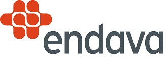
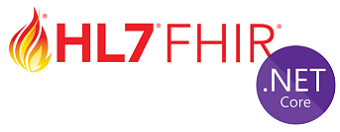
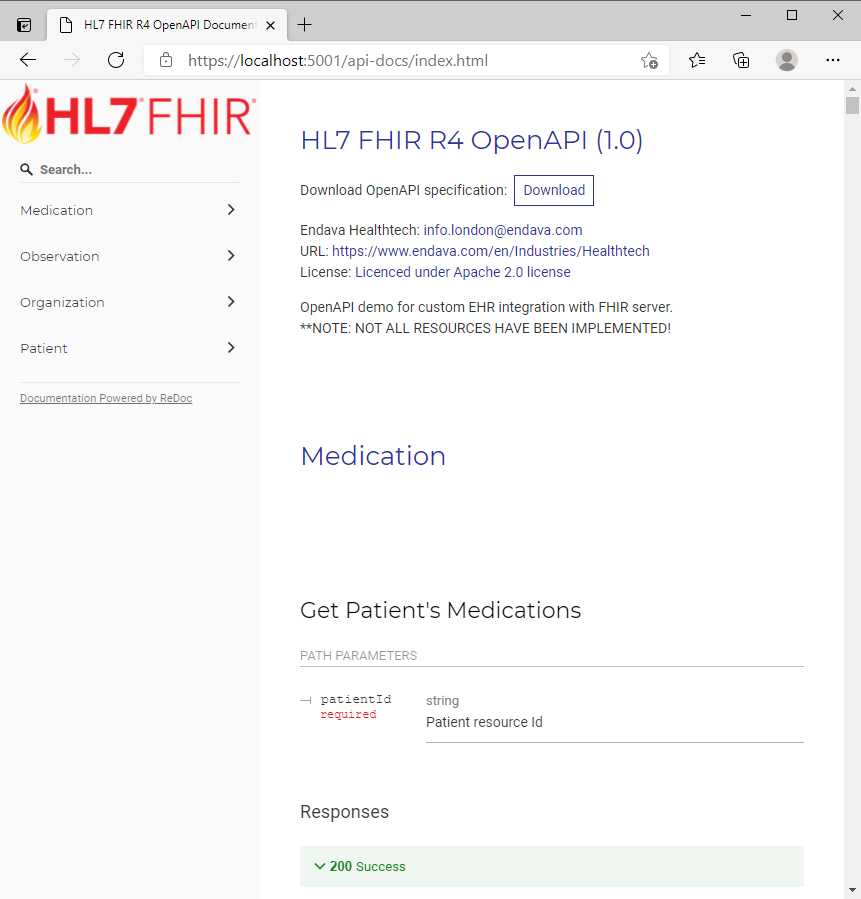
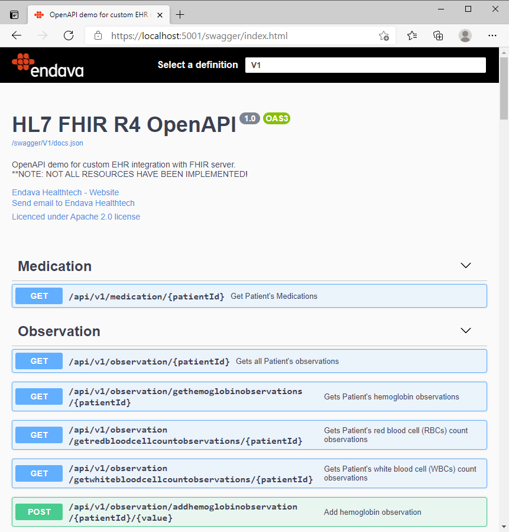

# Endava HL7 FHIR OpenAPI Demo
Batjaz Bravic, Senior Developer

# Introduction

This repo contains demonstration code to illustrate the use of the FIHR standard for healthcare data, developed by the HL7 organisation.  The demonstration shows how to build an OpenAPI to FHIR data using .NET.  The demonstration accompanies a series of blog posts on the [Endava Engineering Blog](https://www.endava.com/en/blog/Engineering) by Matjaz, entitled "Creating EHR to HL7 FHIR Integration - The Software Developer's Guide".

Table of Contents
=================

   * [Overview of the Project](#overview-of-the-project)
   * [What is FHIR?](#what-is-fhir)
     * [Why FHIR?](#why-fhir)
     * [Summary](#summarising-fhir)
   * [Using the Demonstration Code](#using-the-demonstration-code)

# Overview of the Project

When adopting FHIR, a common scenario is needing to convert your existing data into the FHIR model. For this demo, we will be building a OpenAPI which maps custom EHRs into FHIR Patient and Observation resources. Other resources were not implemented (yet).
For this purpose we will use the [.NET 5](https://dotnet.microsoft.com/download/dotnet/5.0),  [Firely .NET SDK](https://fire.ly/products/firely-net-sdk/) and public FHIR server [UHN_HAPI Server](http://hapi.fhir.org) (R4) which is regularly purged and reloaded with fixed test data.

    
# What is FHIR?

**FHIR** (**F**ast **H**ealthcare **I**nteroperability **R**esources) is a new and emerging standard being developed under the auspices of the Health Level Seven (HL7) organization. Pronounced as 'Fire,' it was initially developed by Graham Grieve, who insisted FHIR be **open sourced**. At its core, FHIR is intended to be the next generation of healthcare interoperability. It tries to combine the best features of HL7 Version 2 and Version 3, in which Grieve was significantly involved.

## Why FHIR?
The current predominant method for exchanging clinical data between healthcare applications is known as HL7v2 and it presents serious challenges. Organizations today spend huge amount of money per HL7v2 interface, not to mention licensing fees to implement and use integration engines. Why then we need an integration engine? That's why:

**HL7v2 is a standard but it is NOT an open standard**. You need to be a member of the HL7 organization and pay fees before using the content in any commercial fashion, and HL7v2 is an ancient standard. It was developed in the late 80s when a lot of things we take for granted now didn't exist - mobile numbers, emails, APIs, Cloud, etc.

What resulted was a lot of "I'll just do it my way," causing an explosion of HL7v2 variants. With other words: "Welcome to the jungle!"

Given the above, **FHIR** does offer many improvements over existing standards:

- It's open source: This is a big deal and the first effort in making healthcare integration more transparent and accessible. Putting it out in the open has created a significant community including developers, vendors and enterprises.
- RESTful: REST-based design brings a significant amount of benefit, namely that an API that adheres to the principles of REST does not require the client to know anything about the structure of the API. Rather, the server needs to provide whatever information the client needs to interact with the service.
- Extensible: Extensibility under the RESTful context ensures that additions can be easily tacked on to cover specific use cases without impacting the core models.
- Composable: Composability ensures that almost any request can be cobbled together using core models or resources and associated extensions.
- Good documentation: Uniquely driven by the RESTful API approach, which enforces good documentation as a byproduct.
- Support for modern web standards: XML, JSON, HTTP, Atom, OAuth, REST - these are the underlying technologies that FHIR leverages. These are battle tested and have been proven at scale and under significant security requirements.
- Human readability: HL7 3.0 had a concept of a human readable version of the document or data being shared to ensure that developers or clinicians could still read the source data to eliminate any potential of misconfiguration or coding errors. FHIR borrows this concept as well. Every resource carries a human-readable text representation using html as a fallback display option. This is particularly important for complex clinical information where many systems take a simple textual or document-based approach.

## Summarising FHIR
FHIR is still a work in progress, but it is maturing quickly. It is not an event-based (triggered) protocol. In contrast, HL7v2 pushes data based on some event or activity in the source system. If someone was admitted to the hospital, the source system could be configured to push an ADT message based on the admission. FHIR is currently still a request based protocol.

FHIR has cemented its place as the next interoperability standard for clinical data exchange. Any standard has gaps, but they are neither unexpected nor insurmountable. The Standard, the official blog of the HL7 organization, has frequent updates and news as the FHIR standard evolves.  

FHIR R4, released in 2019, includes a normative base with backwards compatibility, which aims to give developers and organizations confidence that FHIR implementations they undertake will be supported for the foreseeable future and allow developers to implement FHIR more consistently and uniformly. While FHIR Release 4 is the current published version, development on Release 5 is underway with the hope of getting even closer to interoperability.

# Using the Demonstration Code

The demonstration code is a Microsoft Visual Studio project, which you can simply open with VS and use directly.

Enjoy!

## Prerequisites
- [Visual Studio](https://www.visualstudio.com/vs/community) 2019 16.8.1 or greater 
- [.NET 5.x](https://dotnet.microsoft.com/download/dotnet/5.0)

## API documentation

## Swagger UI

## Tags, technologies and sources
- [Swagger](https://swagger.io/) - interactive API documentation
- [API-Docs](https://api-docs.io/) - friendly API documentation
- [Serilog](https://serilog.net/) - flexible, structured logger
- [FluentValidation](https://fluentvalidation.net/) - a popular .NET library for building strongly-typed validation rules
- [Firely .NET SDK](https://fire.ly/products/firely-net-sdk/) - the official HL7 FHIR SDK in .NET

## Further information
- [Extra documentation for FhirClient](https://docs.fire.ly/firelynetsdk/client.html)  
- [HL7 FHIR Restful API specification](https://www.hl7.org/fhir/http.html)
- [Firely .NET SDK FHIR Community](https://chat.fhir.org/#narrow/stream/179171-dotnet)
- [List of FHIR Test servers](https://confluence.hl7.org/display/FHIR/Public+Test+Servers)

## Contributing
Please refer to [CONTRIBUTING.md](CONTRIBUTING.md).

## Trademarks
HL7®, FHIR® and the flame Design mark are the registered trademarks of Health Level Seven International.
